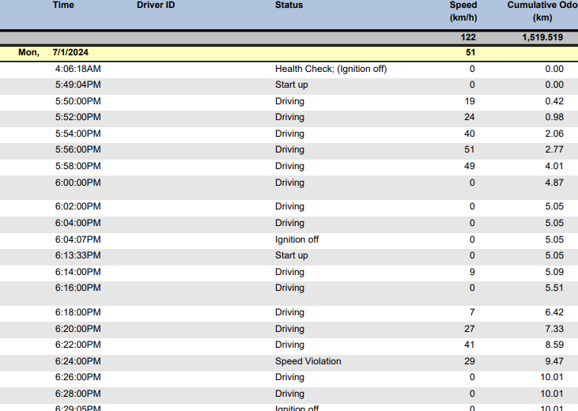

# Drive Assistant

## Overview


## Notes

How to get accurate [Accurate Time](https://lastminuteengineers.com/esp32-ntp-server-date-time-tutorial/) to an ESP32 through wifi.

The compiled sketch is too big if it is compiled normally. Use the following partition scheme instead:

```
Tools -> partition scheme -> "Hugh app (3MB no OTA/ 1MB SPIFFS)"
```

### 26 July 2024
There are 2 speed limit APIs:
1. **Google Roads API**: Paid API, USD 0.02 per request. It is the easier API. Free trail $300 and 87 days remaining.
2. **Overpass API**: More compilacted, but free. It uses nodes to identify a road. With the API call I get the nodes, but not the road, and no speed limit. More testing is required. [Docs](https://wiki.openstreetmap.org/wiki/Overpass_API).
Other useful links:
    - [ExampleRoad](https://www.openstreetmap.org/way/4279932#map=16/-24.9017/27.7493) - Example of a road in OpenStreetMap
    - [OverpassTurbo](https://overpass-turbo.eu/) - A tool to test Overpass API queries
    - Get coordinates from google maps with right click.

### 8 Aug 2024
The DQ Mapper for C and S works most of the time. I can use the DQ Mapper of the planholder to get all the distance information of all the users. Still need to sign into the accounts for the drive dashboard information. 

**TO-DO**
1. Night time drive should rather be calculated, if possible.
2. Access DQ Mapper through plan holder.
3. Insert trigger/wait for user to login then continue execution. The user must manually login into each of the 3 different accounts. 

## 16 September 2024

[HERE Technologies](https://developer.here.com/) offers a comprehensive platform for building location-based applications. The HERE Platform provides APIs and SDKs for geolocation services such as mapping, routing, geocoding, traffic data, and road attributes. With global coverage and high accuracy, developers can integrate rich location intelligence into their applications, including:
- Reverse Geocoding API: Converts coordinates into readable addresses.

This API returns the speed limit of the road. The speed limit is in the `speedLimits` field. The API is free and has a limit of 30,000 requests per month. 

$$\frac{30 000 \text{ calls}}{1 \text{ month}} \times \frac{2 \text{ min}}{1 \text{ call}} \times \frac{1 \text{ hour}}{60 \text{ min}} = \frac{1000 \text{ hours}}{1 \text{ month}}$$

Usage limits will most likely not be exceeded. 1000 hours of usage per month is equivalent to 1 request every 2 minutes.

The full docs can be found [here](https://developer.here.com/documentation/geocoding-search-api/dev_guide/topics/endpoint-reverse-geocode-brief.html).

New API:

```
https://revgeocode.search.hereapi.com/v1/revgeocode?
at=-24.89823311476949,28.216293154714478,50&maxResults=1&
apiKey=XXXd0M&showNavAttributes=speedLimits&types=street
```

TODO: 
1. ~~Protect API KEY.~~
2. Ensure usage does not exceed free tier. See [usage](https://platform.here.com/management/usage).
3. Try to remove payment information.

Cool websites:
1. Get speed limit from a click: [RME Speed Limit Demo](https://demo.support.here.com/examples/v3/rme_speed_limits). Open the console (F12) to see what the API call looks like. It is a older version, but still useful.
2. Get speed limit from coordinates: [Speed Limits using Geocoder + PDE](https://demo.support.here.com/examples/v3/link_speed_locator).

## 20 September 2024
Created here_api.py python files to test the HERE platform API. Simulated location and api responses can be used to reduce the number of api calls made. No further testing for multiple locations was done so far. 

Managed to hide the api key in the keys.py file, included int he venv folder which is not saved to github. 

## Wed 6 Nov 2024
0.001 tolerance on lat long coordinates are about 100m. 

Implemented a cache for the speedlimit data. It also saves all the api call respones in the `here_response_archive` folder.


## Mon 2 Nov 2024

[Guide to NEO-6M GPS Module with Arduino](https://randomnerdtutorials.com/guide-to-neo-6m-gps-module-with-arduino/)

[KitchenSink](https://github.com/mikalhart/TinyGPSPlus/blob/master/examples/KitchenSink/KitchenSink.ino) just about every built-in operation of TinyGPSPlus.

TODO:
1. Display speed limit on the 7-segment display.
2. Allow wifi and bluetooth to be connected at the same time. Currently, bluetooth must be disconnected for the http request to work properly.
3. Debug message for when gps is not ready on the even minute.
4. Check directions next to the calculated direction for a speed limit.
5. Check for speedlimit in json from the start. No need for first items, NavAttributes, etc, separately.
6. Improve the error handling.
7. Round the drive speed in terminal output.