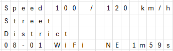

# Drive Assistant

Get the driving speed limit of the current road every 2 minutes.

TODO: Add Image of Box.

## Problem

Every 2 minutes the tracker in the vehicle records the speed of the vehicle and penalizes the driver if the speed limit is exceeded. 

The speed limit of the current road is not always known to the driver, for example when there is no sign. This leads to unfair penalties, as the driver has no clear way of knowing the speed limit.

The table below shows an extract from the movement report, which confirms that the speed of the vehicle is measured every 2 minutes. An example of a speed violation can be seen at 2/4/2025 2:20:00 PM.

| ReportDate | VehicleStatus | MobileSpeed |
|---|---|---|
| 2/4/2025 2:11:14 PM | Start up | 0 |
| 2/4/2025 2:12:00 PM | Driving; (GPS Unlock) | 0 |
| 2/4/2025 2:14:00 PM | Driving | 46 |
| 2/4/2025 2:16:00 PM | Driving | 52 |
| 2/4/2025 2:18:00 PM | Driving | 55 |
| 2/4/2025 2:20:00 PM | Speed Violation | 61 |
| 2/4/2025 2:22:00 PM | Driving | 59 |
| 2/4/2025 2:24:00 PM | Driving | 30 |
| 2/4/2025 2:26:00 PM | Driving | 0 |
| 2/4/2025 2:26:04 PM | Ignition off | 0 |

*Table: Extract from the Movement Report.*

## Solution
Inform the driver of the speed limit of the current road just before every second minute. This ensures the driver is aware of the speed limit and can adhere to it.

A small box was built to display the speed limit to the driver. 

The following parts will be discussed:
1. [GPS](#gps) - Vehicle Coordinates and Speed.
2. [Speed Limit](#speed-limit) - HERE Platform.
3. [Hardware and Integration](#hardware-and-integration).

### GPS
The [NEO-6M GPS module](https://randomnerdtutorials.com/guide-to-neo-6m-gps-module-with-arduino/) was used to get the current speed and GPS coordinates of the vehicle.
The NEO-6M GPS module is affordable, has good accuracy for speed and coordinates, and communicates with UART, making it simple to interface with an ESP32. The [TinyGPS++ Library](https://github.com/mikalhart/TinyGPSPlus) was used to parse the data from GPS module. 

### Speed Limit
[Reverse Geocoding](https://www.here.com/docs/bundle/geocoding-and-search-api-developer-guide/page/topics/endpoint-reverse-geocode-brief.html) from the [HERE Platform](https://platform.here.com/portal/) is used to determine the current road the vehicle is traveling on, based on the coordinates of the GPS module. Since the response is enriched with the [speed limit navigation attributes](https://www.here.com/docs/bundle/geocoding-and-search-api-developer-guide/page/topics/response-items-enrichment-nav.html), the speed limit of the current road can be extracted.

### Hardware and Integration
An ESP32 microcontroller was used as the backbone of the project. The ESP32 has built-in WiFi capabilities, which made it easy to connect to a mobile hotspot for internet access while traveling. It also has all the communication functionality necessary to interface with the GPS module and the LCD screen.

An LCD screen was used to give feedback to the driver. The LCD screen displays the current date, time, vehicle speed and the heading. It also displays the street name, district and the speed limit. When an error occurs, error messages are displayed in the third row.

 \
*Figure: LCD Screen Layout.*

The ESP32, LCD screen, and the GPS module were soldered onto veroboard. The veroboard layout was planned in VeroRoute. 

 \
*Figure: VeroRoute Layout.*

## Considerations and Future Directions 

### Restrictions
The free tier of the HERE API restricts the usage to 83 hours and 20 minutes of operational time per month, given the API is called every 2 minutes.

$$\frac{2 500 \text{ calls}}{1 \text{ month}} \times \frac{2 \text{ min}}{1 \text{ call}} \times \frac{1 \text{ h}}{60 \text{ min}} = \frac{83\text{h}\; 20\text{min}}{1 \text{ month}}$$

### Alternatives
Waze and other similar map providers already display the current speed of the vehicle and the speed limit. However, the downside of these apps is that they consume a lot of mobile data and drain the battery quickly, as the screen needs to remain on continuously.

The developed solution uses minimal mobile data and is powered through a USB cable connected to the vehicle, eliminating the need for constant screen usage and reducing battery drain.

### Possible Future Improvements
Some possible future improvements and bug fixes are given below in descending importance:
1. Restrict the street, district and error message to 20 characters. Change the data type from `string` to `char[20]`.
2. Improve street match by considering drive direction. [Add the bearing parameter to the API call.](https://www.here.com/docs/bundle/geocoding-and-search-api-developer-guide/page/topics-api/code-revgeocode-track-position.html)
3. When the GPS signal is found just before the API is called, the "No Signal Yet!" error message is not cleared. The error message is shown instead of the district.
4. Display nothing when no district is found. Currently, the word "null" is displayed.